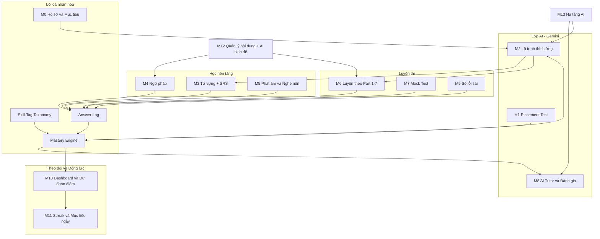
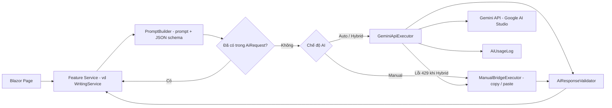
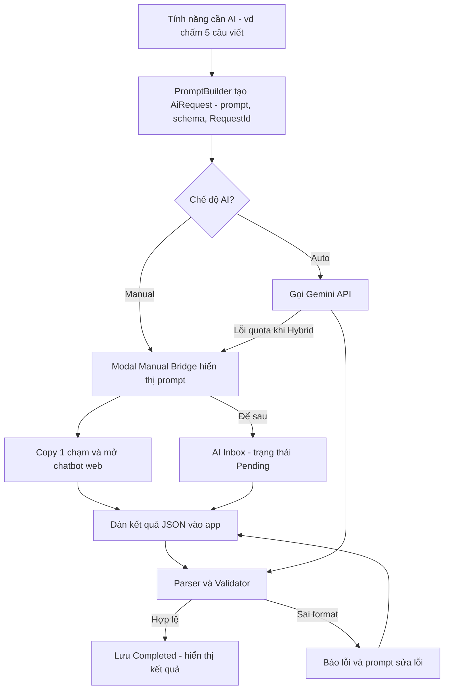
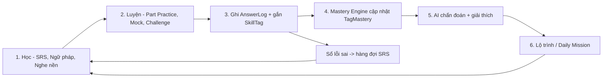
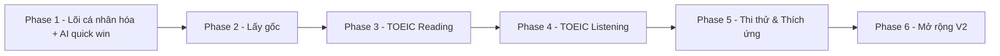

# 📝 DRAFT – Phác thảo Chức năng App Học Tiếng Anh Cá nhân hóa (Lấy gốc → TOEIC)

> **Phiên bản**: 1.0 (Finalized Plan) – Đã hoàn thành phỏng vấn thiết kế qua `/grill-me`
> **Ngày cập nhật**: 2026-10-07
> **Mục tiêu sản phẩm**: Giúp **một người học cụ thể** đi từ mất gốc → nền tảng vững → luyện thi TOEIC Listening & Reading hiệu quả, với **AI đánh giá & cá nhân hóa** là lõi.
> **AI Provider**: Manual AI Bridge (ưu tiên Phase 1) + Google AI Studio Gemini API (Phase sau).

---

## Mục lục

0. [Tóm tắt nhanh (TL;DR)](#0-tóm-tắt-nhanh-tldr)
1. [Hiện trạng ứng dụng & khoảng trống](#1-hiện-trạng-ứng-dụng--khoảng-trống)
2. [Người dùng & Hành trình học](#2-người-dùng--hành-trình-học)
3. [Bản đồ chức năng tổng thể](#3-bản-đồ-chức-năng-tổng-thể)
4. [Đặc tả từng module (bản nháp ban đầu)](#4-đặc-tả-từng-module-bản-nháp-ban-đầu)
5. [Ý tưởng mới đề xuất](#5-ý-tưởng-mới-đề-xuất)
6. [Thiết kế lớp AI (Gemini)](#6-thiết-kế-lớp-ai-gemini)
7. [Phác thảo dữ liệu (Data Model Sketch)](#7-phác-thảo-dữ-liệu-data-model-sketch)
8. [🔁 REVIEW VÒNG 1 – Tính cần thiết](#8--review-vòng-1--tính-cần-thiết)
9. [🔁 REVIEW VÒNG 2 – Mối quan hệ & phụ thuộc](#9--review-vòng-2--mối-quan-hệ--phụ-thuộc)
10. [🔁 REVIEW VÒNG 3 – Khả thi, rủi ro & đối chiếu mục tiêu](#10--review-vòng-3--khả-thi-rủi-ro--đối-chiếu-mục-tiêu)
11. [Lộ trình triển khai đề xuất (Roadmap)](#11-lộ-trình-triển-khai-đề-xuất-roadmap)
12. [Câu hỏi mở cần bạn quyết định](#12-câu-hỏi-mở-cần-bạn-quyết-định)

---

## 0. Tóm tắt nhanh (TL;DR)

- **Xương sống cá nhân hóa** = `Skill Tag` (thẻ kỹ năng) + `Answer Log` (nhật ký trả lời) + `Mastery Engine` (ước lượng mức thành thạo theo từng tag). Mọi tính năng học/luyện đều **ghi log → cập nhật mastery → AI đọc mastery để đề xuất bài tiếp theo**.
- **Vòng lặp học cốt lõi**: `Học → Luyện → Ghi log → AI phân tích → Lập kế hoạch → Học` (xem [mục 9](#9--review-vòng-2--mối-quan-hệ--phụ-thuộc)).
- **AI làm 5 việc chính**: (1) Đánh giá câu viết/phát âm, (2) Giải thích lỗi sai bằng tiếng Việt, (3) Chẩn đoán điểm yếu, (4) Lập & điều chỉnh lộ trình, (5) Sinh nội dung luyện tập (có kiểm duyệt).
- **Thay `IsMastered` (true/false) bằng SRS** (lặp lại ngắt quãng) – đây là nâng cấp có giá trị cao nhất với chi phí thấp nhất dựa trên dữ liệu hiện có.
- **Lộ trình 6 phase**, Phase 1 tận dụng ngay kho từ vựng TOEIC 600 + game hiện có để đưa AI vào sớm.
- **3 chế độ AI**: `Auto` (API key) · `Manual` (copy prompt → chatbot web → dán JSON về app) · `Hybrid` (API, hết quota tự chuyển Manual). → **Mọi tính năng AI dùng được ngay cả khi chưa có API key.**

---

## 1. Hiện trạng ứng dụng & khoảng trống

### 1.1 Đã có

| Nhóm | Chức năng | Ghi chú |
|---|---|---|
| Quản lý nội dung | CRUD Topic / Word, tìm kiếm, lọc, phân trang | `VocabularyService` |
| Dữ liệu | Import/Export CSV, bộ TOEIC 600 từ | `CrawData/` |
| Học từ vựng | Flashcard 3D + TTS, Word Match, Word Scramble, Quiz 4 đáp án | `StudyService`, `Pages/Study/*` |
| Phát âm | Web Speech API (TTS trình duyệt) | `study.js` |

### 1.2 Khoảng trống so với mục tiêu "lấy gốc → TOEIC"

| # | Khoảng trống | Tác động |
|---|---|---|
| G1 | Không có hồ sơ người học, mục tiêu, ngày thi | Không cá nhân hóa được |
| G2 | Trạng thái học chỉ là `IsMastered` (bool) | Không biết **khi nào** cần ôn lại, quên nhanh |
| G3 | Không lưu lịch sử trả lời | Không có dữ liệu để AI phân tích điểm yếu |
| G4 | Chỉ có từ vựng – thiếu ngữ pháp, nghe, đọc | Không bao phủ TOEIC (7 Part) |
| G5 | Không có ngân hàng câu hỏi TOEIC / đề thi thử | Không luyện thi được |
| G6 | Không có AI | Không có đánh giá, giải thích, lộ trình thông minh |
| G7 | Không có dashboard tiến độ / dự đoán điểm | Người học mất động lực, không biết mình ở đâu |

---

## 2. Người dùng & Hành trình học

### 2.1 Persona chính

> **"Minh" – 24 tuổi, nhân viên văn phòng**, mất gốc tiếng Anh từ cấp 3, cần **TOEIC 600+ trong 6 tháng** để xét tăng lương/tốt nghiệp. Mỗi ngày học được **20–40 phút**, chủ yếu buổi tối hoặc lúc đi xe bus (mobile).

**Nhu cầu cốt lõi**: Biết mình yếu gì → Được chỉ học gì hôm nay → Được chấm & giải thích ngay → Thấy tiến bộ bằng con số.

### 2.2 Hành trình 5 chặng

| Chặng | Trình độ (CEFR ≈ TOEIC) | Mục tiêu | Trọng tâm nội dung |
|---|---|---|---|
| **S0 – Chẩn đoán** | — | Biết điểm xuất phát | Placement test thích ứng |
| **S1 – Lấy gốc** | A1–A2 (≈ 120–549) | Phát âm, ~1.000 từ thông dụng, ngữ pháp lõi | IPA, thì cơ bản, từ loại, câu đơn |
| **S2 – Bắc cầu** | A2–B1 (≈ 400–600) | Từ vựng TOEIC 600, ngữ pháp cho Part 5/6 | Word form, giới từ, liên từ, bị động, mệnh đề quan hệ |
| **S3 – Luyện theo Part** | B1 (≈ 550–785) | Chiến lược & tốc độ từng Part 1→7 | Bẫy Part 2, skimming/scanning Part 7 |
| **S4 – Nước rút** | Mục tiêu | Ổn định điểm, quản lý thời gian | Mock test full 200 câu / 120 phút |

> [!NOTE]
> Mốc CEFR ↔ TOEIC tham khảo theo hướng dẫn ETS (A2 ≥ 225, B1 ≥ 550, B2 ≥ 785, C1 ≥ 945). Điểm quy đổi trong app chỉ là **ước lượng**, ETS không công bố bảng quy đổi chính thức.

### 2.3 Cấu trúc TOEIC L&R (dùng để thiết kế Part Practice)

| Phần | Part | Dạng | Số câu |
|---|---|---|---|
| Listening (45') | 1 | Mô tả tranh | 6 |
| | 2 | Hỏi – Đáp | 25 |
| | 3 | Hội thoại | 39 |
| | 4 | Bài nói ngắn | 30 |
| Reading (75') | 5 | Điền câu chưa hoàn chỉnh | 30 |
| | 6 | Điền đoạn văn | 16 |
| | 7 | Đọc hiểu (đơn/kép/ba đoạn) | 54 |

---

## 3. Bản đồ chức năng tổng thể



---

## 4. Đặc tả từng module (bản nháp ban đầu)

> Mỗi module gồm: **Mục đích – Chức năng – Ứng dụng thực tế – Vai trò AI**. Mức ưu tiên cuối cùng được chốt ở [Review vòng 1](#8--review-vòng-1--tính-cần-thiết).

### M0. Hồ sơ & Mục tiêu (Learner Profile & Goal)

- **Mục đích**: Cung cấp "đầu vào" cho mọi quyết định cá nhân hóa.
- **Chức năng**: Điểm mục tiêu (VD 650), ngày thi dự kiến, số phút học/ngày, khung giờ học, trình độ tự đánh giá, giọng đọc ưa thích (US/UK/AU).
- **Ứng dụng**: Từ `ngày thi – hôm nay` và `mục tiêu – điểm hiện tại`, hệ thống tính **khối lượng học cần thiết mỗi ngày** và cảnh báo nếu mục tiêu không thực tế.
- **AI**: Đánh giá tính khả thi của mục tiêu ("650 trong 8 tuần từ mức 300 là rất tham vọng – đề xuất 550 hoặc tăng lên 60 phút/ngày").

### M1. Placement Test thích ứng (Adaptive Placement)

- **Mục đích**: Xác định điểm xuất phát theo **từng kỹ năng**, không chỉ một con số.
- **Chức năng**: 30–40 câu trộn (từ vựng, ngữ pháp, nghe ngắn, đọc ngắn); câu sau khó/dễ hơn tùy câu trước đúng/sai; kết quả là **radar kỹ năng** + CEFR ước lượng + TOEIC band.
- **Ứng dụng**: Người mất gốc không bị "ngợp" bởi câu khó; người đã khá được bỏ qua chặng S1.
- **AI**: Viết **báo cáo chẩn đoán** bằng tiếng Việt: điểm mạnh, 3 điểm yếu ưu tiên, gợi ý chặng bắt đầu.

### M2. Lộ trình học cá nhân hóa (Adaptive Study Plan)

- **Mục đích**: Trả lời câu hỏi "**Hôm nay tôi học gì?**".
- **Chức năng**:
  - Kế hoạch tuần do AI đề xuất (chặng hiện tại, chủ đề, mục tiêu tuần).
  - **Nhiệm vụ hôm nay (Daily Mission)** tự sinh: X thẻ SRS đến hạn + 1 bài ngữ pháp ngắn + N câu luyện Part nhắm vào tag yếu nhất.
  - Tự điều chỉnh khi người học bỏ ngày / vượt tiến độ.
- **Ứng dụng**: Loại bỏ "chi phí quyết định" – mở app là học ngay trong 20 phút.
- **AI**: Đọc mastery + profile → sinh kế hoạch dạng JSON (structured output) → app render.

### M3. Từ vựng nâng cấp + SRS (Spaced Repetition)

- **Mục đích**: Ghi nhớ dài hạn thay vì "đánh dấu đã thuộc".
- **Chức năng**:
  - Thuật toán SRS (SM-2 đơn giản hoặc FSRS) với `DueDate`, `Interval`, `Ease`, `Lapses` cho mỗi từ.
  - Hàng đợi ôn tập hằng ngày; **mọi game hiện có (Flashcard/Match/Scramble/Quiz) đều đẩy kết quả vào SRS**.
  - Từ vựng theo **collocation & word family** (VD: `decide / decision / decisive / decisively`) – cực quan trọng cho Part 5.
- **Ứng dụng**: Học 600 từ TOEIC mà vẫn nhớ sau 3 tháng; ôn đúng từ sắp quên.
- **AI**:
  - **AI Enrich**: khi thêm từ mới, AI tự điền phiên âm, từ loại, nghĩa, ví dụ ngữ cảnh công sở, word family, collocation.
  - **Mnemonic**: gợi ý mẹo nhớ (liên tưởng tiếng Việt).

### M4. Ngữ pháp nền tảng (Grammar Foundation)

- **Mục đích**: Lấp gốc ngữ pháp – nguyên nhân chính mất điểm Part 5/6.
- **Chức năng**: Cây chủ đề ngữ pháp (thì, từ loại & vị trí, giới từ, liên từ, bị động, mệnh đề quan hệ, câu điều kiện, so sánh, đại từ...) – mỗi bài = lý thuyết ngắn + 10 câu luyện + gắn tag.
- **Ứng dụng**: Mỗi chủ đề ngữ pháp được **liên kết với dạng câu Part 5/6 tương ứng** → học xong là luyện ngay đúng dạng thi.
- **AI**: Giải thích lỗi theo góc nhìn người Việt (VD: quên `-s` ngôi 3, thiếu mạo từ, nhầm `V-ing/V-ed` tính từ).

### M5. Phát âm & Nghe nền tảng (Pronunciation & Listening Basics)

- **Mục đích**: Nền tảng cho Listening (50% điểm TOEIC).
- **Chức năng**:
  - Bảng IPA tương tác, cặp âm tối thiểu (`ship/sheep`, `live/leave`).
  - **Dictation** (nghe – chép chính tả) với so khớp từng từ.
  - **Shadowing** (nghe – nói đuổi) có ghi âm.
  - Luyện nghe **4 giọng TOEIC** (Mỹ, Anh, Úc, Canada).
- **Ứng dụng**: Người mất gốc thường "nghe không ra từ đã biết" – dictation & shadowing xử lý đúng vấn đề này.
- **AI**:
  - **Đánh giá phát âm**: ghi âm (MediaRecorder) → gửi audio cho Gemini → nhận xét từ phát âm sai, trọng âm, nối âm.
  - **Gemini TTS**: sinh audio tự nhiên, nhiều giọng, hội thoại nhiều người nói.

### M6. Luyện TOEIC theo Part (Part Practice 1–7)

- **Mục đích**: Luyện kỹ năng & chiến lược riêng cho từng Part.
- **Chức năng**:
  - Ngân hàng câu hỏi gắn tag (Part, kỹ năng, chủ đề, độ khó).
  - Chế độ: luyện tự do / theo tag yếu / bấm giờ.
  - Thẻ chiến lược mỗi Part (VD Part 2: nhận diện bẫy đồng âm, câu hỏi gián tiếp).
- **Ứng dụng**: Biến kiến thức nền thành điểm số thông qua làm quen dạng đề.
- **AI**: Giải thích đáp án + **lý do đáp án nhiễu hấp dẫn** (bẫy gì); sinh câu hỏi mới cho Part 5/6/7 (text) và Part 2/3/4 (script + TTS).

### M7. Mock Test & Dự đoán điểm

- **Mục đích**: Mô phỏng thi thật, đo tiến bộ.
- **Chức năng**: Full test (200 câu/120') và Mini test (100 câu/60'); chấm & quy đổi điểm ước lượng; chế độ review sau thi.
- **Ứng dụng**: Luyện sức bền & phân bổ thời gian; mốc đo định kỳ (2 tuần/lần).
- **AI**: Phân tích sau thi – thời gian trung bình theo Part, nhóm lỗi, so sánh với lần trước.

### M8. AI Tutor & Đánh giá (★ trọng tâm)

| Tính năng | Mô tả | Ứng dụng |
|---|---|---|
| **AI Explain** | Giải thích câu sai bằng tiếng Việt, dẫn về bài ngữ pháp liên quan | Hiểu "tại sao", không học vẹt đáp án |
| **AI Error Diagnosis** | Phân loại lỗi theo tag sau mỗi phiên | Dữ liệu cho Mastery Engine & lộ trình |
| **AI Writing Feedback** | Chấm câu/đoạn người học viết: ngữ pháp, dùng từ, tự nhiên | Chủ động hóa từ vựng (passive → active) |
| **AI Speaking Feedback** | Chấm đọc to / shadowing | Cải thiện nghe nhờ phát âm đúng |
| **AI Contextual Chat** | Hỏi thêm về **câu đang làm** (không phải chat tự do) | Giống hỏi thầy ngay tại chỗ |
| **AI Weekly Report** | Báo cáo tuần: tiến bộ, điểm yếu, kế hoạch tuần sau | Duy trì động lực & định hướng |

### M9. Sổ lỗi sai (Mistake Notebook)

- **Mục đích**: Không bao giờ sai lại một lỗi cũ.
- **Chức năng**: Tự động gom câu sai; ghi chú cá nhân; luyện lại theo lịch.
- **Ứng dụng**: Trước kỳ thi, ôn sổ lỗi sai hiệu quả hơn làm đề mới.
- **AI**: Gom nhóm lỗi tương tự ("Bạn sai 7 lần về giới từ chỉ thời gian `in/on/at`").

### M10. Dashboard & Phân tích

- **Chức năng**: Radar kỹ năng, xu hướng điểm ước lượng, heatmap ngày học, thời gian học, số từ thuộc theo SRS, **dự đoán điểm tại ngày thi**.
- **Ứng dụng**: Nhìn thấy tiến bộ → có động lực; thấy lệch tiến độ → điều chỉnh sớm.

### M11. Động lực (Gamification nhẹ)

- **Chức năng**: Streak, mục tiêu phút/ngày, XP, huy hiệu mốc (100 từ, Part 5 ≥ 80%...).
- **Ứng dụng**: Tạo thói quen học hằng ngày.

### M12. Quản lý nội dung + AI sinh đề

- **Chức năng**: Mở rộng Import/Export cho **câu hỏi, đoạn văn, audio**; pipeline AI sinh nội dung → **trạng thái Draft → người dùng duyệt → Published**.
- **Ứng dụng**: Mở rộng ngân hàng đề nhanh mà vẫn kiểm soát chất lượng.

### M13. Hạ tầng AI (kỹ thuật)

- `IAiService` (trừu tượng) → `GeminiAiService` (triển khai), prompt template có version, JSON schema output, cache kết quả, giới hạn quota, log chi phí, fallback khi lỗi/offline. Chi tiết ở [mục 6](#6-thiết-kế-lớp-ai-gemini).

---

## 5. Ý tưởng mới đề xuất

| # | Ý tưởng | Giải thích & ứng dụng | Liên kết module |
|---|---|---|---|
| 💡1 | **Skill Tag Taxonomy** | Bộ thẻ kỹ năng chuẩn (VD `GRAM.TENSE.PRESENT_PERFECT`, `VOC.WORD_FORM.ADJ`, `LIS.P2.INDIRECT_ANSWER`, `READ.P7.INFERENCE`). Mọi từ/câu hỏi/bài học đều gắn tag → đo mastery chi tiết. **Đây là chìa khóa cá nhân hóa.** | Tất cả |
| 💡2 | **"Truyện từ từ của tôi" (AI Story from My Words)** | AI viết email/thông báo kiểu TOEIC Part 7 chứa **chính các từ đang đến hạn ôn** + 3 câu hỏi đọc hiểu. Ôn từ vựng trong ngữ cảnh thật & luyện đọc cùng lúc. | M3 ↔ M6 ↔ M8 |
| 💡3 | **Thử thách đặt câu (Sentence Challenge)** | Cho 1 từ → người học tự đặt câu → AI chấm (đúng ngữ pháp? đúng nghĩa? tự nhiên?) và gợi ý câu tốt hơn. Biến từ "nhận biết" thành "sử dụng được". | M3 ↔ M8 |
| 💡4 | **Trap Detector (Giải mã bẫy)** | Với mỗi đáp án nhiễu, AI gắn nhãn loại bẫy: đồng âm, lặp từ, sai thì, đúng ý nhưng sai chủ thể... Sau thời gian, app biết người học **hay dính loại bẫy nào**. | M6 ↔ M8 ↔ M10 |
| 💡5 | **Dictation chấm bằng AI diff** | So sánh bản chép với transcript; AI phân loại lỗi: không nghe ra âm cuối, nối âm, từ chưa biết → gợi ý luyện tiếp. | M5 ↔ M3 |
| 💡6 | **Giải thích kiểu "thầy giáo Việt"** | Prompt yêu cầu AI so sánh với cấu trúc tiếng Việt & lỗi kinh điển của người Việt. Hiệu quả hơn giải thích tiếng Anh thuần cho người mất gốc. | M4 ↔ M8 |
| 💡7 | **Exam Sprint Mode** | Tự kích hoạt 2–4 tuần trước ngày thi: giảm bài mới, tăng mock test + sổ lỗi sai + chiến lược thời gian. | M0 ↔ M2 ↔ M7 ↔ M9 |
| 💡8 | **Score Predictor có khoảng tin cậy** | Dự đoán "Nếu giữ nhịp hiện tại, ngày thi bạn đạt ~580 (±40)". Cảnh báo sớm khi lệch mục tiêu. | M10 ↔ M2 |
| 💡9 | **Micro-learning 5 phút** | Gói bài siêu ngắn (10 thẻ SRS / 5 câu Part 5) cho lúc rảnh trên mobile, vẫn tính vào streak. | M2 ↔ M11 |
| 💡10 | **Audio Accent Switch** | Cùng một câu, nghe lại bằng giọng Mỹ/Anh/Úc (Gemini TTS) – TOEIC dùng nhiều giọng, người Việt thường chỉ quen giọng Mỹ. | M5 ↔ M6 |
| 💡11 | **Manual AI Bridge** *(ý tưởng của chủ dự án)* | Chưa có API key / hết quota → app hiển thị **đúng prompt + định dạng output**; người dùng dán vào chatbot web (Gemini, ChatGPT...) rồi dán kết quả JSON về app. Chi phí 0, không bị rate limit. Chi tiết [mục 6.4](#64-chế-độ-ai-thủ-công--manual-ai-bridge-không-cần-api-key). | M13 ↔ M8, M2, M12 |

---

## 6. Thiết kế lớp AI (Gemini)

### 6.1 Bảng ca sử dụng AI

| Ca sử dụng | Đầu vào | Đầu ra (JSON schema) | Model đề xuất | Tần suất | Cache? |
|---|---|---|---|---|---|
| Enrich từ vựng | Term | phonetic, pos, meaning_vi, examples[], word_family[], collocations[] | Flash-Lite | Thấp | ✅ Lưu vĩnh viễn vào DB |
| Giải thích câu hỏi | Câu hỏi + đáp án chọn + đáp án đúng | explanation_vi, trap_type, related_tags[], grammar_ref | Flash-Lite | Cao | ✅ Theo (QuestionId, đáp án chọn) |
| Chấm câu viết | Từ mục tiêu + câu người học | score 0–10, errors[{span, type, fix, why_vi}], better_version | Flash | TB | ❌ |
| Chấm phát âm | Audio + câu chuẩn | overall, words[{word, issue, tip_vi}] | Flash (audio) | TB | ❌ |
| Báo cáo chẩn đoán / tuần | Thống kê mastery + log rút gọn | strengths[], weaknesses[], plan_next[] | Flash | Thấp | ✅ Theo tuần |
| Lập lộ trình | Profile + mastery | weeks[{goal, items[]}] | Flash | Thấp | ✅ |
| Sinh câu hỏi Part 5/6/7 | Tag + độ khó + từ vựng | question, options[4], answer, explanation, tags[] | Flash | Theo lô | ✅ Lưu vào ngân hàng (Draft) |
| Sinh audio Part 2/3/4 | Script nhiều người nói | File audio | Gemini TTS | Theo lô | ✅ Lưu file tĩnh |

> [!TIP]
> **Nguyên tắc tiết kiệm quota**: Nội dung **dùng chung** (giải thích câu hỏi, audio, enrich từ) chỉ gọi AI **một lần rồi lưu DB/file**. Chỉ nội dung **do người học tự tạo** (câu viết, ghi âm) mới gọi AI theo thời gian thực.

### 6.2 Kiến trúc tích hợp



- **Bảo mật API key**: Blazor Server chạy phía server → key **không lộ ra trình duyệt**. Cho phép nhập key trong trang Cài đặt (lưu mã hóa bằng ASP.NET Data Protection) hoặc qua `dotnet user-secrets` / biến môi trường; **không commit** vào `appsettings.json`. Chưa có key → app tự dùng chế độ Manual.
- **Tên model đặt trong cấu hình** (`Ai:Models:Fast`, `Ai:Models:Smart`, `Ai:Models:Tts`) để đổi model không cần sửa code.
- **Structured Output**: luôn dùng `responseSchema` (JSON) → parse về DTO C#, tránh parse text tự do.
- **Prompt có version** (VD `explain_question_v2`) – lưu kèm kết quả để so sánh chất lượng khi đổi prompt.
- **Fallback**: AI lỗi/hết quota → chế độ Hybrid chuyển yêu cầu đó sang **Manual Bridge** ([mục 6.4](#64-chế-độ-ai-thủ-công--manual-ai-bridge-không-cần-api-key)); không chặn luồng học.

### 6.3 Ví dụ JSON schema – Chấm câu viết

```json
{
  "score": 7,
  "is_meaning_correct": true,
  "errors": [
    {
      "span": "He have finished",
      "type": "GRAM.SUBJECT_VERB_AGREEMENT",
      "fix": "He has finished",
      "why_vi": "Chủ ngữ ngôi thứ 3 số ít (He) đi với 'has', không dùng 'have'."
    }
  ],
  "better_version": "He has already finished the quarterly report.",
  "encouragement_vi": "Bạn dùng đúng nghĩa của 'quarterly' rồi, chỉ cần chú ý chia động từ!"
}
```

### 6.4 Chế độ AI thủ công – Manual AI Bridge (không cần API key)

> **Ý tưởng (từ chủ dự án)**: Khi chưa nhập API key hoặc hết quota, app hiển thị **đúng nội dung sẽ gửi cho AI** kèm **định dạng output bắt buộc**. Người dùng copy sang chatbot trên web, rồi dán kết quả về app. App kiểm tra & lưu **y hệt** như khi gọi API.

**Đánh giá**: ✅ Rất phù hợp với app cá nhân.

| Ưu điểm | Đánh đổi |
|---|---|
| Chi phí 0, không bị rate limit API | Thêm thao tác thủ công (copy → dán) |
| Dùng được model mạnh nhất có trên bản web | Không realtime – kết quả có thể đến sau |
| Minh bạch: thấy đúng prompt → vừa học vừa debug prompt | Chatbot web có thể trả sai format |
| Phát triển & kiểm thử prompt **trước** khi tích hợp API | Không dùng được cho audio (TTS) |

#### 6.4.1 Ba chế độ AI (trang Cài đặt)

| Chế độ | Khi nào dùng | Hành vi |
|---|---|---|
| 🅰 **Auto** | Có API key, quota thoải mái | Gọi Gemini API trực tiếp |
| 🅼 **Manual** | Chưa có key (mặc định khi cài mới) | Hiển thị prompt → copy → dán kết quả |
| 🅷 **Hybrid** *(khuyến nghị)* | Có key nhưng free tier thấp | Gọi API; khi lỗi 429 / hết giới hạn ngày / mất mạng → **tự chuyển yêu cầu đó sang Manual**, không mất dữ liệu |

#### 6.4.2 Luồng người dùng



#### 6.4.3 Mẫu prompt hiển thị trên màn hình (ví dụ chấm câu)

````text
[LearnNN-AI] request_id: WRT-20261007-0042 | prompt: grade_sentence_v1

VAI TRÒ: Bạn là giáo viên tiếng Anh cho người Việt đang luyện TOEIC.
NHIỆM VỤ: Chấm câu người học tự đặt với từ mục tiêu. Giải thích bằng tiếng Việt,
          so sánh với cấu trúc tiếng Việt khi hữu ích.
DỮ LIỆU:
- Từ mục tiêu: "quarterly" (adjective) – hàng quý
- Câu của người học: "He have finished the quarterly report yesterday."

ĐỊNH DẠNG ĐẦU RA (bắt buộc):
Chỉ trả về MỘT khối ```json, không viết gì thêm, đúng cấu trúc:
{
  "request_id": "WRT-20261007-0042",
  "score": <số nguyên 0-10>,
  "is_meaning_correct": <true|false>,
  "errors": [{"span": "...", "type": "<mã lỗi>", "fix": "...", "why_vi": "..."}],
  "better_version": "...",
  "encouragement_vi": "..."
}
Mã lỗi hợp lệ: GRAM.TENSE, GRAM.SUBJECT_VERB_AGREEMENT, GRAM.ARTICLE,
               VOC.WRONG_WORD, VOC.COLLOCATION, VOC.WORD_FORM, OTHER
````

> [!NOTE]
> Prompt Manual và prompt API **sinh từ cùng một template**. Khác biệt duy nhất: bản API truyền schema qua `responseSchema`, bản Manual nhúng schema + ví dụ vào văn bản prompt.

#### 6.4.4 Thiết kế giảm thao tác thủ công (quan trọng nhất)

| Kỹ thuật | Mô tả | Hiệu quả |
|---|---|---|
| **Gộp lô (Batch)** | 1 prompt cho nhiều mục: chấm 5 câu, giải thích **tất cả câu sai cuối phiên Quiz**, enrich 20–50 từ, sinh 10 câu Part 5 → output là mảng JSON theo `item_id` | Giảm 5–50 lần copy/dán |
| **AI Inbox** | Yêu cầu chưa có kết quả lưu trạng thái `Pending`; người học tiếp tục học, xử lý sau. Badge số lượng trên NavMenu | Không làm gián đoạn luồng học |
| **Copy 1 chạm + mở chatbot** | Nút "📋 Copy & mở Gemini" (JS interop clipboard + mở tab mới). Danh sách chatbot cấu hình được | 1 click thay vì bôi đen + chuyển tab |
| **Parser khoan dung** | Tự bóc khối ```` ```json ````, bỏ text thừa trước/sau, sửa lỗi nhỏ (dấu phẩy cuối, smart quotes) | Giảm lỗi do chatbot "nói thêm" |
| **request_id** | Chatbot phải trả lại `request_id` → phát hiện dán nhầm kết quả của yêu cầu khác | Chống sai dữ liệu |
| **Prompt sửa lỗi** | JSON sai schema → app tạo prompt ngắn: *"Kết quả trước thiếu trường `score`, hãy trả lại đúng JSON"* | Sửa nhanh trong cùng cuộc chat |
| **Cache dùng chung** | Kết quả Manual lưu cùng bảng với API → gặp lại câu hỏi đó không phải làm lại | Mỗi nội dung chỉ hỏi AI 1 lần |
| **Prompt gọn** | Chỉ gửi dữ liệu cần thiết, không gửi lịch sử dài | Dễ copy trên mobile |

#### 6.4.5 Ma trận hỗ trợ theo ca sử dụng

| Ca sử dụng | Manual? | Ghi chú |
|---|:-:|---|
| Enrich từ vựng | ✅ Rất hợp | Gộp 20–50 từ/lần, dùng luôn để làm bộ từ nền 1.000 từ |
| Giải thích câu hỏi + Trap | ✅ | Gộp các câu sai cuối phiên |
| Chấm câu viết (Sentence Challenge) | ✅ | Gộp 5 câu/lần |
| Báo cáo chẩn đoán / tuần, lập lộ trình | ✅ Rất hợp | Tần suất thấp, prompt chứa thống kê rút gọn |
| Sinh câu hỏi Part 5/6/7 | ✅ Rất hợp | Theo lô 10–20 câu → vào Draft chờ duyệt |
| Script hội thoại Part 2/3/4 | ✅ (phần text) | Audio đọc bằng Web Speech API (đã có) thay Gemini TTS |
| Chấm phát âm | ⚠️ Hạn chế | Phải tải file ghi âm về rồi upload lên chatbot kèm prompt – khả thi nhưng nhiều bước |
| Sinh audio TTS | ❌ | Fallback Web Speech API của trình duyệt |
| Contextual Chat | ➖ | Không cần – nút "Copy ngữ cảnh câu hỏi" để hỏi trực tiếp trên chatbot web |

#### 6.4.6 Tác động kiến trúc

- Tách **`PromptBuilder`** (template + schema, dùng chung) khỏi **kênh thực thi** `IAiExecutor` gồm `GeminiApiExecutor` và `ManualBridgeExecutor`. Feature service **không biết** đang dùng kênh nào.
- **`AiResponseValidator`** dùng chung cho 2 kênh – Manual không được "dễ dãi" hơn API.
- UI dự kiến: `Components/Shared/AiManualBridgeModal.razor` (dùng ở nhiều trang), `Pages/Ai/AiInbox.razor`, `Pages/Settings/AiSettings.razor`.
- Bảo mật: nội dung dán vào chỉ render dạng text (không `MarkupString`) để tránh XSS; giới hạn độ dài (VD 50 KB).
- **Hệ quả quan trọng**: Toàn bộ tính năng AI của Phase 1 có thể làm & dùng **trước khi có API key**; `GeminiApiExecutor` chỉ là bước cắm thêm.

---

## 7. Phác thảo dữ liệu (Data Model Sketch)

> Chỉ là bản phác thảo để đánh giá phạm vi; thiết kế chi tiết sẽ làm ở task riêng và cập nhật `02_database_design.md`.

| Entity | Mục đích | Trường chính |
|---|---|---|
| `LearnerProfile` | Hồ sơ & mục tiêu | TargetScore, ExamDate, DailyMinutes, PreferredAccent, CurrentStage |
| `SkillTag` | Taxonomy kỹ năng | Code, Name, Category (Vocab/Grammar/Listening/Reading), ParentId |
| `TagMastery` | Mức thành thạo theo tag | SkillTagId, Score (0–1), Attempts, LastPracticedAt |
| `WordProgress` | Trạng thái SRS từng từ (thay `IsMastered`) | WordId, DueDate, IntervalDays, Ease, Reps, Lapses |
| `GrammarLesson` | Bài ngữ pháp | Title, ContentMarkdown, Level, SkillTagIds |
| `QuestionGroup` | Nhóm câu chung đoạn/audio (Part 3/4/6/7) | Part, PassageText, AudioPath, ImagePath, Transcript |
| `Question` | Câu hỏi | GroupId?, Part, Stem, OptionsJson, CorrectIndex, Difficulty, Status (Draft/Published), Source (Manual/AI) |
| `QuestionTag` | N-N Question ↔ SkillTag | QuestionId, SkillTagId |
| `StudySession` | Phiên học | Type (SRS/Grammar/Part/Mock/Placement), StartedAt, DurationSec |
| `AnswerLog` | **Nhật ký mọi câu trả lời** | SessionId, ItemType (Word/Question), ItemId, IsCorrect, ChosenIndex, TimeMs |
| `MistakeEntry` | Sổ lỗi sai | ItemType, ItemId, WrongCount, Note, NextReviewAt |
| `MockTestResult` | Kết quả thi thử | ListeningRaw, ReadingRaw, EstListening, EstReading, PartBreakdownJson |
| `StudyPlan` / `PlanItem` | Lộ trình & nhiệm vụ ngày | WeekStart, Goal / Date, ItemType, TargetRef, IsDone |
| `AiRequest` | Yêu cầu AI = **hàng đợi + cache + lịch sử** (thay `AiFeedback`) | RequestId, Kind, PromptVersion, InputHash, PromptText, Channel (Api/Manual), Status (Pending/Completed/Invalid), ResponseJson, ModelLabel, CreatedAt, CompletedAt |
| `AppSetting` | Cài đặt người dùng | AiMode (Auto/Manual/Hybrid), EncryptedApiKey, PreferredChatbotUrl, DailyApiLimit |
| `AiUsageLog` | Theo dõi quota | Model, InputTokens, OutputTokens, LatencyMs, Success |

---

## 8. 🔁 REVIEW VÒNG 1 – Tính cần thiết

> **Câu hỏi kiểm tra**: Module này có trực tiếp giúp người học **(a) lấy gốc**, **(b) tăng điểm TOEIC**, hoặc **(c) cá nhân hóa** không? Có thể gộp/cắt/hoãn không?

| Module | (a) | (b) | (c) | Kết luận | Điều chỉnh |
|---|:-:|:-:|:-:|---|---|
| M0 Hồ sơ | | | ✅ | 🔴 **Must** | Bắt đầu **single-user** (1 profile), chưa cần đăng nhập. Entity vẫn có `LearnerId` để mở rộng sau. |
| M1 Placement | ✅ | | ✅ | 🔴 **Must** | V1 dùng **đề cố định 30 câu chia mức** (đơn giản), adaptive thật để sau. |
| M2 Lộ trình | ✅ | ✅ | ✅ | 🔴 **Must** | V1: Daily Mission bằng **luật (rule-based)**; AI chỉ viết kế hoạch tuần & lời khuyên. Lý do: luật dễ kiểm soát, không tốn quota mỗi ngày. |
| M3 Từ vựng + SRS | ✅ | ✅ | ✅ | 🔴 **Must** | Giá trị cao nhất / chi phí thấp nhất – tận dụng code sẵn có. |
| M4 Ngữ pháp | ✅ | ✅ | | 🔴 **Must** | Thu gọn còn ~20 chủ đề **phục vụ Part 5/6**, không làm giáo trình ngữ pháp đầy đủ. |
| M5 Phát âm & Nghe nền | ✅ | ✅ | | 🟡 **Should** | Dictation trước (rẻ, hiệu quả); Shadowing + chấm phát âm AI sau. |
| M6 Part Practice | | ✅ | ✅ | 🔴 **Must** | Làm **Reading (5/6/7) trước** – nội dung text dễ tạo hơn Listening. Part 1 (cần ảnh) để cuối. |
| M7 Mock Test | | ✅ | | 🟡 **Should** | Phụ thuộc ngân hàng đề đủ lớn → làm sau M6. |
| M8 AI Tutor | ✅ | ✅ | ✅ | 🔴 **Must** | ❌ **Cắt chat tự do** → chỉ giữ **Contextual Chat** (gắn với câu hỏi đang làm) để tập trung & kiểm soát chi phí. |
| M9 Sổ lỗi sai | | ✅ | ✅ | 🟡 **Should → Gộp** | **Gộp engine vào SRS**: câu sai trở thành "thẻ ôn" trong hàng đợi chung. Vẫn giữ trang xem riêng. |
| M10 Dashboard | | | ✅ | 🟡 **Should** | V1: radar + streak + số từ thuộc. Score Predictor sau khi có mock test. |
| M11 Gamification | | | | 🟢 **Could** | Chỉ giữ **streak + mục tiêu ngày**. Bỏ XP/huy hiệu ở V1 (không trực tiếp tăng điểm). |
| M12 Nội dung + AI sinh đề | ✅ | ✅ | | 🔴 **Must** | Không có nội dung thì M6/M7 vô nghĩa. Bắt buộc có bước **duyệt** trước khi publish. |
| M13 Hạ tầng AI | | | | 🔴 **Must** (nền) | Làm 1 lần, mọi tính năng AI dùng chung. |

**Ý tưởng mới – đánh giá cần thiết:**

| Ý tưởng | Kết luận | Lý do |
|---|---|---|
| 💡1 Skill Tag | 🔴 Must | Không có tag = không cá nhân hóa được |
| 💡2 AI Story | 🟡 Should | Rất hợp mục tiêu nhưng cần SRS + Part 7 trước |
| 💡3 Sentence Challenge | 🔴 Must | Quick win AI, dùng ngay dữ liệu 600 từ |
| 💡4 Trap Detector | 🟡 Should | Gộp vào output của "AI Explain" (thêm trường `trap_type`) – gần như miễn phí |
| 💡5 Dictation AI diff | 🟡 Should | Diff làm bằng code, AI chỉ phân loại lỗi |
| 💡6 Giải thích kiểu Việt | 🔴 Must | Chỉ là **prompt engineering**, không tốn thêm tính năng |
| 💡7 Sprint Mode | 🟢 Could | Cần M7 + M9 trước |
| 💡8 Score Predictor | 🟢 Could | Cần ≥ 2 mock test để có ý nghĩa |
| 💡9 Micro-learning | 🟡 Should | Chỉ là preset của Daily Mission |
| 💡10 Accent Switch | 🟢 Could | Cần audio TTS sẵn có |
| 💡11 Manual AI Bridge | 🔴 Must | App cá nhân + free tier giới hạn → đây là điều kiện để ưu tiên "AI đánh giá" không phụ thuộc ngân sách. Đồng thời là fallback cho Hybrid |

**❌ Cắt khỏi phạm vi V1**: Chat AI tự do, AI sinh ảnh cho Part 1, đăng nhập đa người dùng, bảng xếp hạng, TOEIC Speaking & Writing (để V2 – hạ tầng chấm viết/nói có thể tái sử dụng).

---

## 9. 🔁 REVIEW VÒNG 2 – Mối quan hệ & phụ thuộc

### 9.1 Vòng lặp học cốt lõi (Core Learning Loop)



> **Kiểm tra**: Mọi module Must đều nằm **trên vòng lặp này**. Module nào không ghi `AnswerLog` thì không đóng góp cho cá nhân hóa → đây là **quy tắc bắt buộc** cho mọi tính năng luyện tập sau này (kể cả 4 game hiện có phải được sửa để ghi log).

### 9.2 Ma trận phụ thuộc

| Module ↓ cần → | Tag | Log | Mastery | M13 AI | M12 Nội dung | M0 | M3 SRS |
|---|:-:|:-:|:-:|:-:|:-:|:-:|:-:|
| M1 Placement | ✅ | ✅ | ✅ | ○ | ✅ | | |
| M2 Lộ trình | | | ✅ | ○ | | ✅ | ✅ |
| M3 SRS | ○ | ✅ | | ○ | | | |
| M4 Ngữ pháp | ✅ | ✅ | | ○ | ✅ | | |
| M6 Part Practice | ✅ | ✅ | ✅ | ✅ | ✅ | | |
| M7 Mock | ✅ | ✅ | | ○ | ✅ | | |
| M8 AI Tutor | ✅ | ✅ | ✅ | ✅ | | ✅ | |
| M9 Sổ lỗi | | ✅ | | ○ | | | ✅ |
| M10 Dashboard | ✅ | ✅ | ✅ | ○ | | ✅ | ✅ |

✅ bắt buộc · ○ tùy chọn/tăng cường

### 9.3 Phát hiện & điều chỉnh sau vòng 2

| # | Vấn đề phát hiện | Điều chỉnh |
|---|---|---|
| R2-1 | **Cold start**: M2 cần mastery nhưng người dùng mới chưa có dữ liệu | Placement (M1) là bước onboarding bắt buộc; nếu bỏ qua → dùng lộ trình mặc định theo trình độ tự khai báo (M0). |
| R2-2 | **Skill Tag là phụ thuộc của gần như mọi thứ** nhưng chưa có trong draft roadmap đầu | Đưa Tag + AnswerLog + Mastery lên **Phase 1**, trước cả AI. |
| R2-3 | M6/M7 phụ thuộc M12 (nội dung) – nếu làm UI trước sẽ "có vỏ không ruột" | Làm **pipeline nội dung + import** cùng lúc hoặc trước UI Part Practice. |
| R2-4 | AI Explain gọi rất nhiều lần → tốn quota | **AiFeedback cache** phải có ngay trong M13 từ đầu, không để "tối ưu sau". |
| R2-5 | M9 và M3 trùng logic lịch ôn | Dùng chung **ReviewScheduler** (SRS) cho cả từ vựng và câu hỏi sai. |
| R2-6 | 4 game hiện có chỉ set `IsMastered` → không đóng góp dữ liệu | Refactor `StudyService` để ghi `AnswerLog` + cập nhật `WordProgress`; giữ `IsMastered` như cờ hiển thị suy ra từ SRS (Interval ≥ 21 ngày) để không phá UI cũ. |
| R2-7 | M4 Ngữ pháp và M6 Part 5 tách rời → học xong không biết luyện ở đâu | Liên kết 2 chiều qua Skill Tag: bài ngữ pháp có nút "Luyện Part 5 dạng này"; câu Part 5 sai có link "Ôn lại bài ngữ pháp". |
| R2-8 | M8 Writing Feedback và 💡3 Sentence Challenge trùng nhau | Gộp: Sentence Challenge = **giao diện**, Writing Feedback = **dịch vụ AI** bên dưới; V2 dùng lại cho TOEIC Writing. |
| R2-9 | 💡11 Manual Bridge khiến AI trở thành **bất đồng bộ** (kết quả có thể đến sau vài giờ) | Mọi tính năng phải chịu được trạng thái "chờ AI": `AnswerLog`/Mastery cập nhật ngay **không chờ AI**; AI chỉ bổ sung giải thích / tag lỗi khi có. |
| R2-10 | AI Error Diagnosis (M8) cấp tag lỗi cho Mastery – nếu yêu cầu còn Pending thì Mastery thiếu dữ liệu | Mastery dùng **tag tĩnh của câu hỏi** trước; tag lỗi chi tiết từ AI cập nhật bổ sung khi `AiRequest` Completed. |
| R2-11 | Enrich từ, Explain, sinh đề, chấm câu đều cần **gộp lô** để Manual dùng được | `PromptBuilder` hỗ trợ batch (mảng `item_id`) **ngay từ đầu** – cũng giúp tiết kiệm request khi dùng API. |
| R2-12 | Contextual Chat (M8) và Manual Bridge chồng chéo | Manual: thay bằng nút "Copy ngữ cảnh câu hỏi" – không cần xây UI chat riêng trong V1. |

---

## 10. 🔁 REVIEW VÒNG 3 – Khả thi, rủi ro & đối chiếu mục tiêu

### 10.1 Đối chiếu mục tiêu: chặng học ↔ module

| Chặng | Module phục vụ | Vai trò AI | Đủ chưa? |
|---|---|---|---|
| S0 Chẩn đoán | M1, M0 | Báo cáo chẩn đoán | ✅ |
| S1 Lấy gốc | M3, M4, M5 (IPA, dictation) | Enrich từ, giải thích kiểu Việt, Sentence Challenge, chấm phát âm | ✅ – ⚠️ cần bổ sung **bộ từ vựng nền ~1.000 từ thông dụng** (hiện chỉ có TOEIC 600) |
| S2 Bắc cầu | M3 (TOEIC 600 + word family), M4 ↔ M6 Part 5/6 | Explain + Trap | ✅ |
| S3 Luyện Part | M6, M9 | Explain, Trap, AI Story, sinh đề | ✅ |
| S4 Nước rút | M7, M9, Sprint Mode, M10 | Phân tích sau thi, weekly report | ✅ (Phase sau) |
| Xuyên suốt: Cá nhân hóa | Tag, Log, Mastery, M2 | Lộ trình, chẩn đoán | ✅ |
| Xuyên suốt: **AI đánh giá** (ưu tiên của bạn) | M8 + M13 + 💡11 | — | ✅ Có mặt ngay từ Phase 1, **kể cả khi chưa có API key** |

### 10.2 Rủi ro & biện pháp

| Rủi ro | Mức | Biện pháp |
|---|---|---|
| **AI sinh đề sai đáp án / không giống đề thật** | 🔴 Cao | Bắt buộc trạng thái Draft → duyệt; AI tự kiểm tra chéo (gọi lần 2 để "giải" câu vừa sinh, loại câu nếu không khớp đáp án); ưu tiên câu nhập tay/nguồn hợp lệ. |
| **Bản quyền đề ETS** | 🔴 Cao | **Không** crawl/sao chép đề ETS; chỉ dùng nội dung tự soạn, AI sinh, hoặc nguồn cho phép. |
| **Chấm phát âm bằng Gemini không chính xác ở mức âm vị** | 🟡 TB | Hiển thị là "nhận xét tham khảo", không chấm điểm cứng. Nếu cần chính xác cao → cân nhắc dịch vụ chuyên dụng (VD Azure Pronunciation Assessment) ở V2. |
| **Free tier giới hạn quota & dữ liệu có thể được dùng để cải thiện model** | 🟢 Thấp *(giảm nhờ 💡11)* | Hybrid → Manual Bridge khi hết quota; cache mạnh, batch, Flash-Lite cho tác vụ nhẹ, `AiUsageLog` + giới hạn lượt/ngày; không gửi thông tin cá nhân nhạy cảm. |
| **Thao tác Manual phiền → người dùng bỏ qua AI** | 🟡 TB | Gộp lô, AI Inbox, copy 1 chạm + mở chatbot, prompt gọn; đo tỷ lệ yêu cầu Pending bị bỏ quên. |
| **Chatbot web trả sai format / bịa nội dung** | 🟡 TB | Validator chung với API, `request_id`, ví dụ output trong prompt, prompt sửa lỗi; nội dung sinh đề vẫn qua bước duyệt Draft. |
| **Kết quả không đồng nhất giữa các chatbot/model** | 🟢 Thấp | Lưu `ModelLabel` + `PromptVersion` trong `AiRequest`; schema chặt giúp kết quả so sánh được. |
| **Ghi âm micro cần HTTPS & quyền trình duyệt** | 🟢 Thấp | Chạy HTTPS (đã có trong Blazor template); xử lý trường hợp từ chối quyền. |
| **Độ trễ AI làm gián đoạn trải nghiệm** | 🟡 TB | Gọi bất đồng bộ, hiển thị skeleton/loading; giải thích được **sinh trước theo lô** cho câu hỏi trong ngân hàng. |
| **SQLite & Blazor Server khi nhiều người dùng** | 🟢 Thấp (V1 single-user) | Giữ SQLite cho V1; khi multi-user chuyển PostgreSQL/SQL Server. |
| **Phạm vi quá lớn cho 1 dev** | 🔴 Cao | Chia 6 phase, mỗi phase **dùng được ngay**; ưu tiên Reading trước Listening. |
| **Model Gemini thay đổi tên/phiên bản** | 🟢 Thấp | Tên model nằm trong config; `IAiService` trừu tượng để có thể đổi provider. |

### 10.3 Điều chỉnh cuối sau vòng 3

1. **Thêm bộ từ vựng nền (~1.000 từ thông dụng)** cho chặng S1 – có thể dùng AI Enrich để điền dữ liệu, rồi import qua CSV hiện có.
2. **Audio TTS sinh trước & lưu file** (`wwwroot/audio/...` hoặc thư mục data riêng), không sinh realtime khi người học bấm nghe.
3. **Cơ chế tự kiểm chéo** cho AI sinh đề trở thành yêu cầu bắt buộc của M12.
4. **Manual AI Bridge là kênh AI đầu tiên được xây** (Phase 1), Gemini API cắm thêm sau – giúp kiểm thử prompt thủ công trước khi tốn quota.
5. **Chỉ số thành công (KPI)** để đánh giá app có hiệu quả không:
   - Tỷ lệ giữ nhớ SRS (retention) ≥ 85%.
   - Streak trung bình ≥ 5 ngày/tuần.
   - Điểm mock test tăng ≥ 50 điểm sau mỗi 4 tuần.
   - Tag yếu nhất cải thiện ≥ 15% sau 2 tuần luyện tập trung.

---

## 11. Lộ trình triển khai đề xuất (Roadmap)



| Phase | Nội dung | Giá trị người học nhận được |
|---|---|---|
| **P1 – Lõi + AI quick win** | M0 Profile (single-user) · Skill Tag · AnswerLog · Mastery Engine · SRS (`WordProgress`) + refactor 4 game ghi log · M13 Hạ tầng AI: `PromptBuilder` (hỗ trợ batch) · **Manual AI Bridge + AI Inbox** · `GeminiApiExecutor` + Hybrid · `AiRequest` cache · trang Cài đặt AI · **AI Enrich từ** · **Sentence Challenge (AI chấm câu)** · **AI Explain cho Quiz** | Ôn từ đúng lúc + được AI chấm & giải thích ngay trên 600 từ TOEIC sẵn có – **không cần API key** |
| **P2 – Lấy gốc** | M1 Placement (đề cố định) · M4 Ngữ pháp (~20 chủ đề) · Bộ từ nền 1.000 từ · M9 Sổ lỗi sai (dùng chung ReviewScheduler) · M2 Daily Mission (rule-based) · M10 Dashboard v1 · Streak | Biết mình ở đâu, mỗi ngày có nhiệm vụ rõ ràng |
| **P3 – TOEIC Reading** | Ngân hàng câu hỏi (Question/QuestionGroup/Tag) · M12 Import + AI sinh đề Part 5/6/7 có duyệt & tự kiểm chéo · M6 Part 5/6/7 · Trap Detector · 💡AI Story from My Words | Luyện đúng dạng đề Reading, hiểu bẫy |
| **P4 – TOEIC Listening** | Gemini TTS sinh audio (đa giọng, đa người nói) · M5 Dictation (AI diff), Shadowing, chấm phát âm · M6 Part 2/3/4 · Part 1 (ảnh tự upload) · Accent Switch | Luyện nghe 4 giọng, cải thiện phát âm |
| **P5 – Thi thử & Thích ứng** | M7 Mock/Mini test + quy đổi điểm ước lượng · AI kế hoạch tuần & Weekly Report · Score Predictor · Sprint Mode · Placement adaptive | Đo tiến bộ, lộ trình tự điều chỉnh tới ngày thi |
| **P6 – V2 (tùy chọn)** | Đăng nhập đa người dùng · TOEIC Speaking & Writing (tái dùng Writing/Speaking Feedback) · PWA/offline · Gamification mở rộng · Chuyển DB server | Mở rộng sản phẩm |

---

## 12. Các quyết định thiết kế đã chốt qua /grill-me

| # | Hạng mục | Quyết định đã chốt | Tác động kỹ thuật |
|---|---|---|---|
| 1 | **Mô hình người dùng** | **Single-user (Cá nhân)**: 1 hồ sơ học tập duy nhất trong SQLite, không cần hệ thống Auth/Đăng nhập phức tạp. | Schema vẫn giữ `LearnerId` để sẵn sàng scale đa người dùng ở V2. |
| 2 | **Phạm vi bài thi** | **TOEIC Listening & Reading (Part 1 - 7)**: Tận dụng AI chấm câu viết/phát âm như công cụ bổ trợ học từ vựng. | Không làm đề thi TOEIC Speaking & Writing riêng; tập trung tối đa cho 2 kỹ năng cốt lõi. |
| 3 | **Kênh thực thi AI** | **Manual AI Bridge trước, Gemini API sau**: Xây dựng modal copy prompt + JSON schema, dán kết quả về app. | Không phụ thuộc API key, không bị rate limit, kiểm thử tính năng ngay lập tức. |
| 4 | **Tích hợp SRS** | **Tích hợp toàn diện**: 4 game hiện tại (Flashcards, Match, Scramble, Quiz) đều tự động ghi `AnswerLog` và nuôi thuật toán SRS; `IsMastered` suy ra từ khoảng cách ôn. | Dữ liệu học tập thống nhất, người dùng học ở đâu cũng được tính tiến độ ngắt quãng. |
| 5 | **Tính năng AI đầu tiên** | **AI Quiz Explainer & Trap Detector**: Tích hợp ngay vào `/study/quiz` để mỗi khi làm sai câu hỏi là AI giải thích lý do & vạch trần bẫy. | Tạo giá trị "AI đánh giá" thấy được ngay trên kho 600 từ TOEIC hiện có. |
| 6 | **Nguồn nội dung đề thi & bài học** | **Nhập thủ công & Import file CSV/JSON từ tài liệu chuẩn uy tín**: Đảm bảo sát đề thi thật 100%. | AI chỉ đóng vai trò **Đánh giá, Giải thích lỗi, Lập lộ trình**, KHÔNG dùng AI tự bịa câu hỏi đề thi thiếu kiểm soát. |

---

> 📌 **Trạng thái**: Đã thống nhất 100% thiết kế. Chuyển sang thực hiện kế hoạch công việc WBS (Task 16 -> 22).
